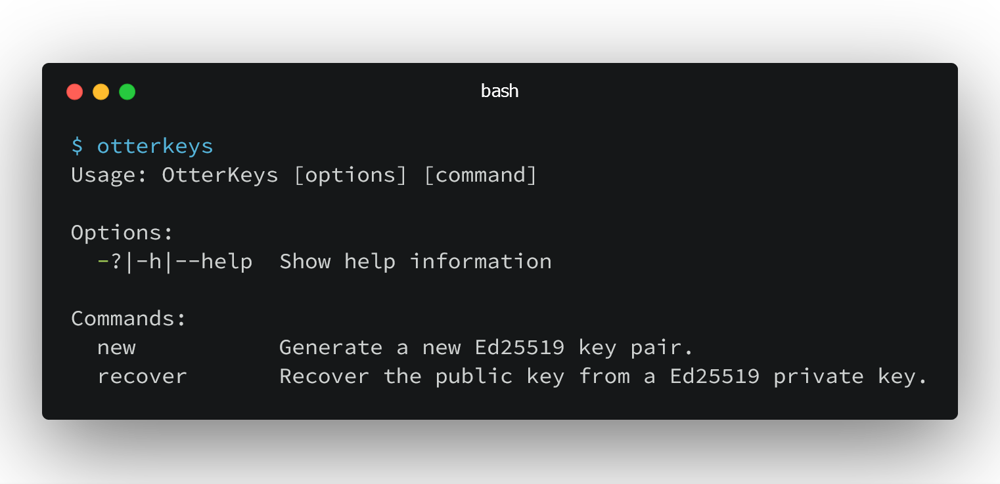
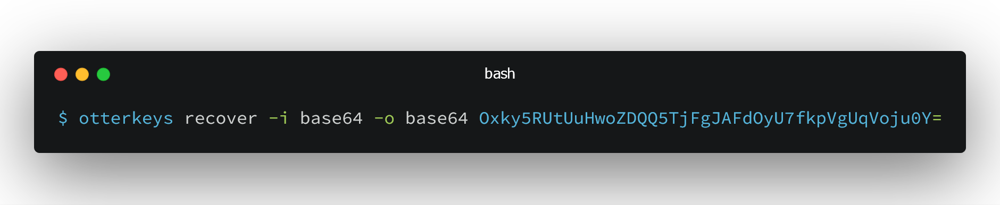

# :rat::closed_lock_with_key: OtterKeys

A .NET Core Tool to quickly create Ed25519 key pairs for signing and verifying
messages or other data.

## Installation

Download and install the [.NET Core 2.1 SDK](https://www.microsoft.com/net/download)
or newer. Once installed, run the following command to run OtterKeys:

## Usage

Once installed you can call OtterKeys from the command line:

> You can use the --help option to get more details about the commands and
their options.

### Creating a new key pair

> Creating a new Ed25519 key pair is as easy as typing:

Otter will print the private and public key.

The private key should be stored securely and should be unique for each of your
products. The public key is distributed with your software.

## Specify key pair output format

You can specify a key pair output format by adding the option `-o`. Possible
formats are `base64`, `byte` and `hex`. Example:

The default output format is a base64 formatted string.

## Recovering a public key

> A lost public key can be recovered from a private key by running the
following command:

You can specify an input and output format by adding the options `-i` and `-o`.
The `recover` command supports `base64` and `hex` as input formats, and
`base64`, `byte` and `hex` as output formats.

Example:

## Acknowledgements

Otter uses the excellent [NSec library](https://nsec.rocks/).
